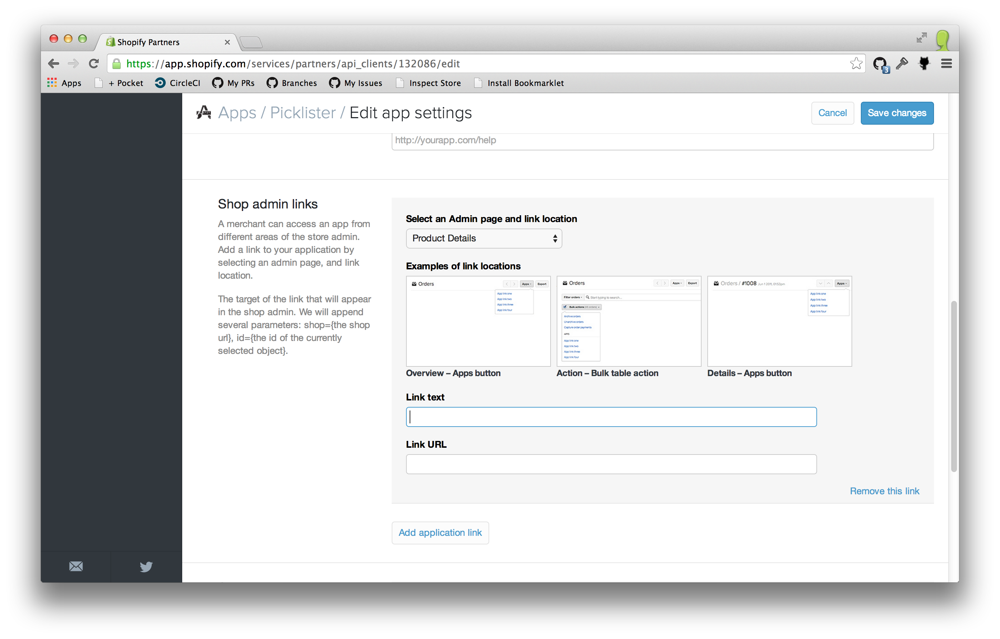
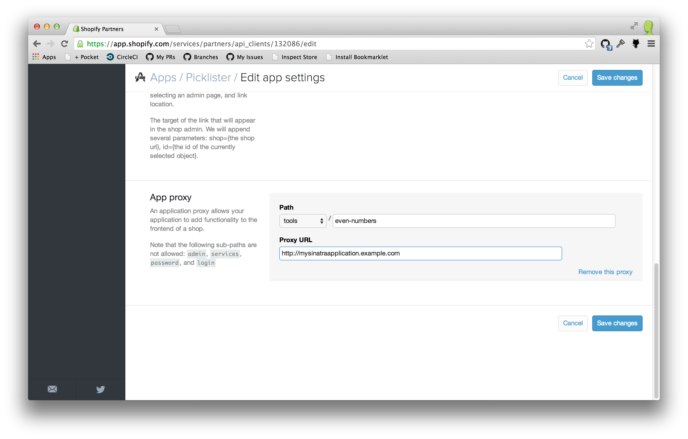
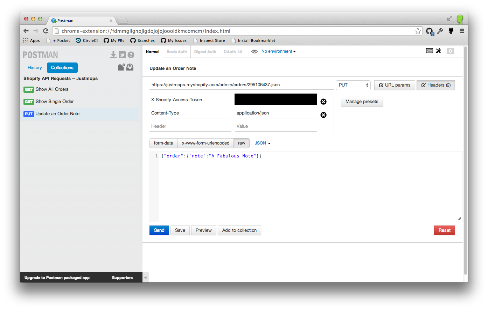

# The Shopify API

### Chris Saunders

---

# API?

## Allows developers to extend the Shopify platform

---

# What kinds of needs do merchants have?

---

## Unique Integrations

## Deeper Analysis

## Complex Processing

---

Box and Arrow simplification of REST API

---

Shopify as the client, sending data to your server

---

Your app embedded in Shopify storefront or admin

---

# API Demo

---

# REST and Shopify

### Turn all of these into single slides

All of Shopifys resources follow a similar pattern:

- List a page of Resources:
  `GET https://domain/admin/resource_name.json`
- List a single Resource:
  `GET https://domain/admin/resource_name/resource_id.json`

---

# REST and Shopify

- Create a Resource:
  `POST https://domain/admin/resource_name.json`
- Update a Resource:
  `PUT https://domain/admin/resource_name/resource_id.json`
- Destroy a Resource:
  `DELETE https://domain/admin/resource_name/resource_id.json`

---

# Working with the API - HTTP Request

 TODO: Just use plain HTTP requests

 ---

# Working with the API - HTTP Response

```ruby
# Fetch a list of orders
require 'net/http'
uri = URI('https://justmops.myshopify.com/admin/orders.json')
Net::HTTP.start(uri.host, uri.port, use_ssl: true) do |client|
  request = Net::HTTP::Get.new(uri)
  request['Content-Type'] = 'application/json'
  request['Accept'] = 'application/json'
  request['X-Shopify-Access-Token'] = 'access token'

  response = client.request(request)
  puts response.body
  # {"orders":[{"buyer_accepts_mark....
end
```


---

# Shopify API Resources

The data in a response can be sent back to Shopify to update a resource:

```ruby
require 'net/http'
require 'json'
uri = URI('https://justmops.myshopify.com/admin/orders/1234.json')
content = JSON.parse(authenticated_get_request(uri))
# All Shopify resources are wrapped in a root object (pluralized for collections)
order = content['order']
order['note'] = 'Just jotting down a couple of notes on the order'

Net::HTTP.start(uri.host, uri.port, use_ssl: true) do |client|
  request = Net::HTTP::Put.new(uri)
  request['X-Shopify-Access-Token'] = 'access token'
  request['Content-Type'] = 'application/json'
  request['Accept'] = 'application/json'
  request.body = {'order' => order}.to_json

  response = client.request(request)
  # List, Show and Update all return 200 OK
  puts response.code # 200
end
```

---

# Staying up to date with Webhooks

- Let us tell you when things have changed
- Don't bite into your API call limits
- Let you subscribe to the kinds of data you are interested in
- Data is signed

---

# Webhooks

- You need the right permissions to register for a webhook
  - Can't register for order creation webhooks if you can only read products
- Don't include historical data
  - Webhooks contain a snapshot of the data when it was delivered, not when it was queued

---

# Webhooks

- The data in the webhook is slightly different from our API responses
  - No root node (i.e. {data} instead of {order: {data}})

---

# Registering a Webhook

```ruby
require 'net/http'
require 'json'
setup_client('webhooks.json') do |client, uri|
  webhook = {
    type: 'json',
    topic: 'product/update'
    address: 'http://yourserver.com/shopify/webhooks'
  }
  request = Net::HTTP::Post.new(uri)
  request.body = {webhook: webhook}.to_json

  client.request(request)
end
```

---

# Supporting multiple Shops

- Install App from App Store
- Show how to set up an OAuth app from partners dashboard

---

# Serving your Apps

Use the Embedded App SDK to give your customers a nicer experience

- Provides hooks to use Shopify styled modals, popups, etc.
- Keep user within their Admin instead of going to another website

---

# App Links

- Provide contextual actions on shopify resources
- Shortcuts to areas of your application
- Added through the Partner Dashboard

---



---

SCREENSHOT IN ADMIN

---

# Shop Storefront

## Script Tags to easily provide storefront javascript
## Application proxies to provide custom URLs

---

# Application Proxies

- Allow you to render data in the storefront
- Can return liquid and Shopify will render it!
- Just returning plain HTML just works

---



---

# Application Proxy Example

```ruby
require 'sinatra'

get '/proxies/products-with-even-ids' do
  headers 'Content-Type' => 'application/liquid'
  """
  <p>Products with Even Ids</p>
  
    <ul>
      
        <li>{{ product.title }}</li>
      
    </ul>
  
  """
end
```

---

# Script Tags

## Let's you inject external javascript into a shops storefront
## Associated to an app installation. Removing app also removes the script tags

---

# Registering a Script Tag

```ruby
require 'net/http'
require 'json'
# Let's ignore the boilerplate
setup_client('script_tags.json') do |client, uri|
  script_tag = {
    script_tag: {
      src: 'http://yourservice.com/some.js'
    }
  }
  request = Net::HTTP::Post.new(uri)
  request.body = script_tag.to_json

  response = client.request(request)
  puts response.code # 201
end
```

---

# Multipass

- Only available to Shopify Plus customers
- Associates Shopify customers with external identities (e.g from forums)
- Shop needs to have multipass enabled on their Checkout Settings

---

# Registering a Multipass Customer

## FLOWCHART

---

# Carrier Services

---

# Tools

- Exposing development environments to the world
- API Client Libraries
- Ways to Easily Play with the API

---

# Exposing your environment to the world

`ngrok 3000`

- You can use ngrok to expose your development server to the world
- Use the given domain when registering webhooks, carrier services, etc.

---

# Official API Client Libraries

## github.com/shopify/shopify_api
## github.com/shopify/shopify\_python\_api

---



---

# Getting Help

---

# ecommerce.shopify.com/c/shopify-apis-and-technology

---

# Q & A
