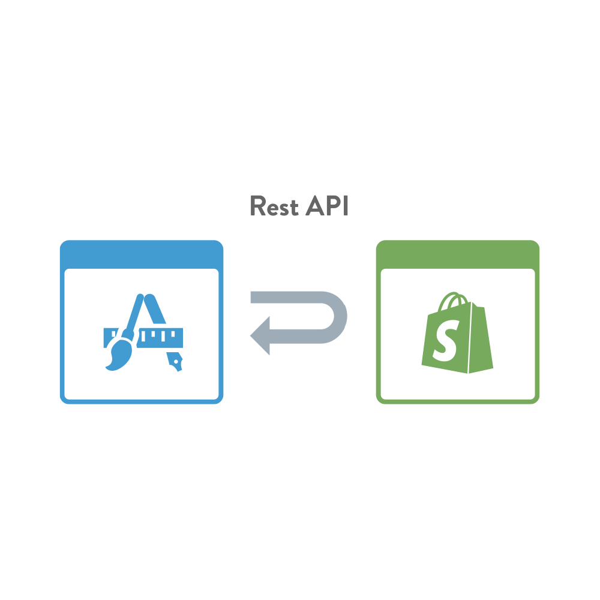
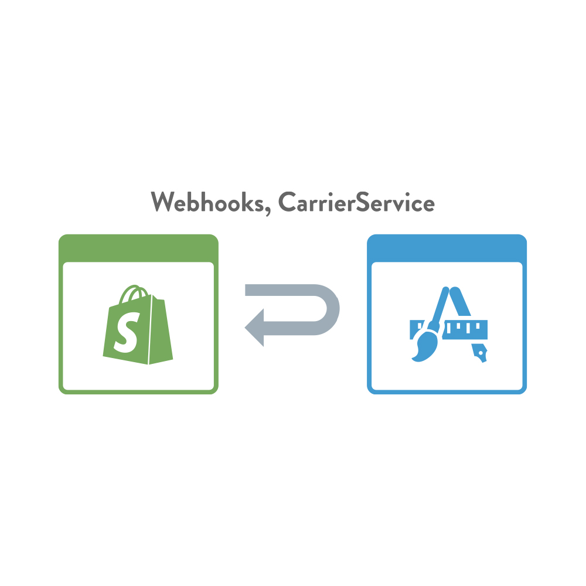
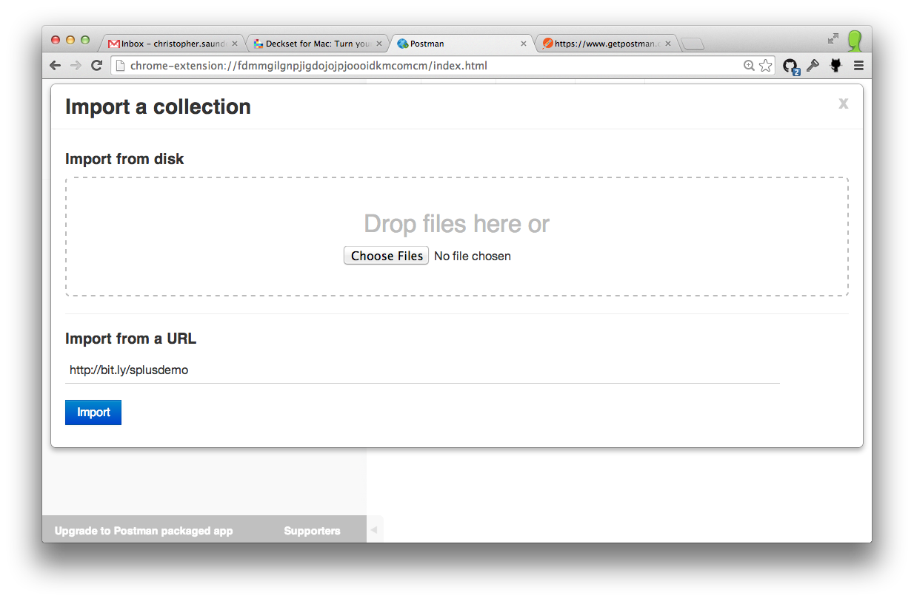
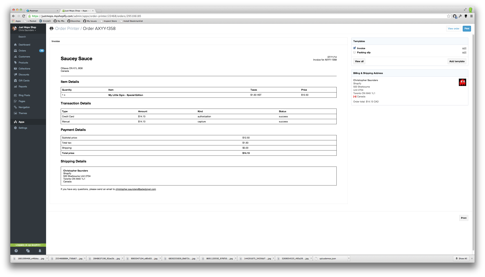
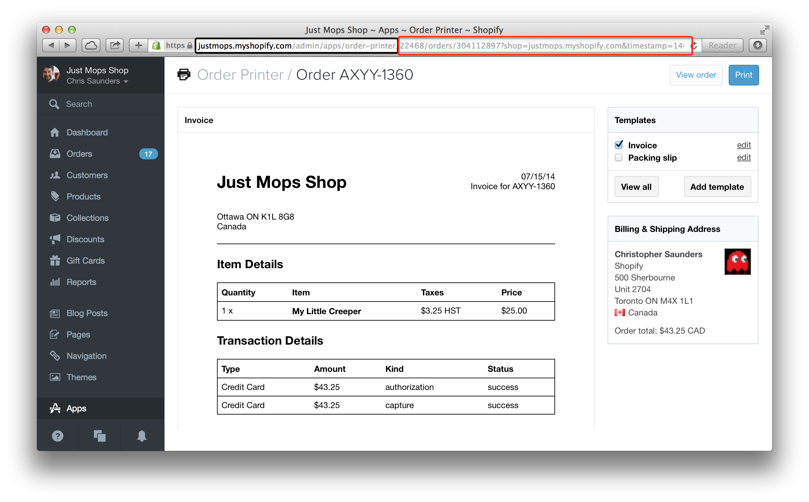
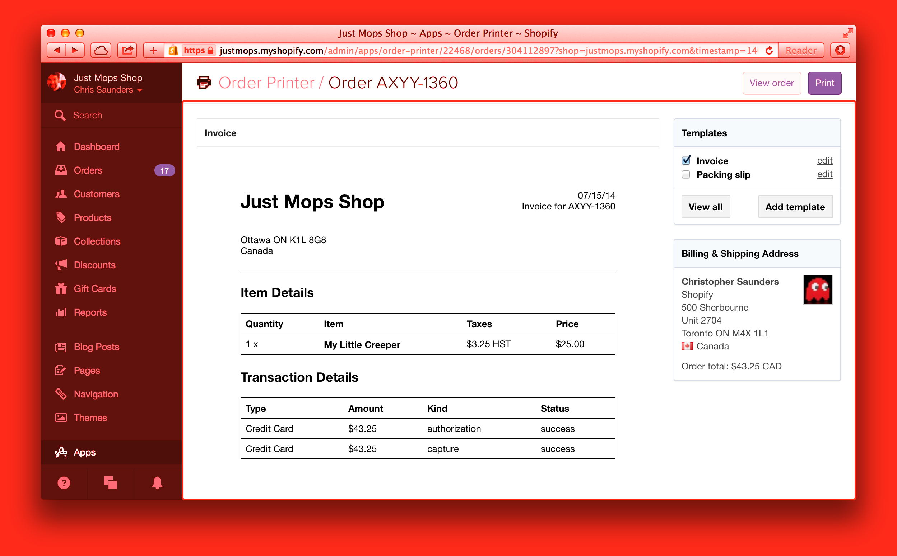
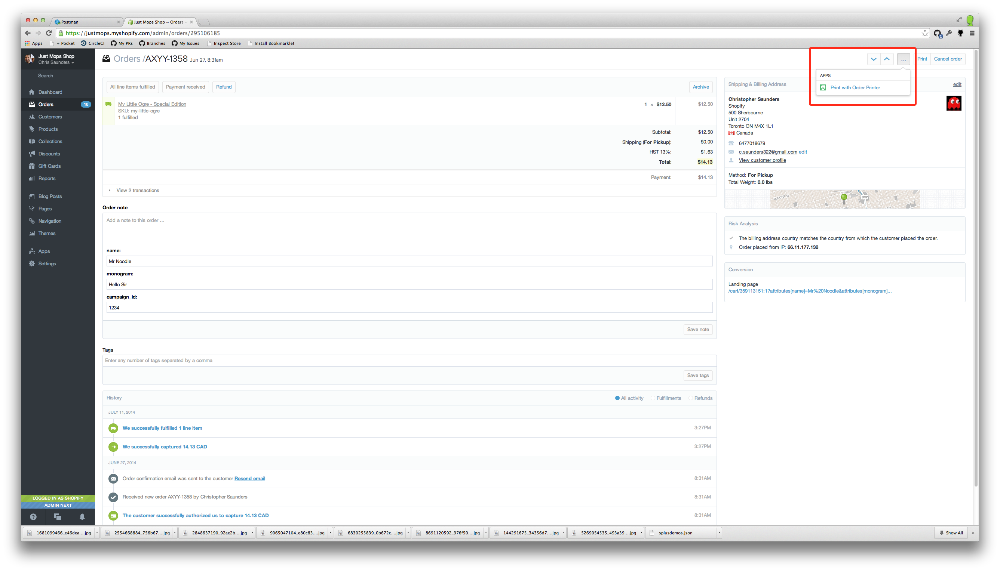

# The Shopify API

^ Hello my name is Chris Saunders

^ I'll be covering the various aspects of the Shopify API as well as
  some tools that you use to simplify working with the API

^ Incognito Window
  http://ngrok.com
  http://requestb.in
  chrome-extension://fdmmgilgnpjigdojojpjoooidkmcomcm/index.html

^ Regular Window
  shopify-plus-test-shop.myshopify.com/admin/staff

---

# API?

^ So why do we have an API?

^ There's a lot of features merchants want, though they may not be required by everyone

^ By providing an API we make it easier for developers to extend the Shopify platform to meet those needs

---

# Meet The Team


^ From left to right: Helen Tran, Chris Saunders, James MacAulay, Nate Smith and Adam Doeler

^ We're out there building new features, fixing bugs you come across and even watching the forums to
  help you solve any problems you might be experiencing

---

# Ways to Integrate with Shopify

---



^You can be a typical application where you are simply making calls to Shopify and reading or manipulating data

---



^Alternatively there's the kinds of apps where Shopify contacts you

^This could include things like being a Carrier Service that provides Shipping Rates

^Or simply being informed about what kinds of events have happened to a shop through the use of Webhooks

---


^Finally there's the situation where your application is embedded within Shopify

^The most basic way this is achieved is through the use of our Embedded App SDK which makes your app useable from within the admin

^You can also embed your application, or part of it within a shops storefront

---

# What kinds of needs do merchants have?

---

## Unique Integrations

## Deeper Analysis

## Complex Processing

^ Some of to the things merchants have required custom solutions in the past, include: (read listed items)

---


^ Alright, so now that we've covered some of the reasons for using the API let's dig into things

---


^ We'll start off by covering how to play with the API

^ Now you'll want to open up the Postman Chrome Extension if you have it installed

---

# bit.ly/splusdemo

^ I've gone ahead and crafted several examples of how an API request is made to Shopify that you can import into your Postman

---



^ This is the import screen, simply set the import URL

---

# API Demo

## List Products

### GET https://domain/admin/products.json

---

# API Demo

## Get Single Product

### GET https://domain/admin/products/1234.json

---

# API Demo

## Create A Product

### POST https://domain/admin/products.json

---

# API Demo

## Update a Product

### PUT https://domain/admin/products/1234.json

---

# API Demo

## Remove a Product

### DELETE https://domain/admin/products/1234.json

---

# Shopify Success Codes

---

# 200 OK


^ For most successful requests you'll simply get a 200 back.

^ Any successful GET request will return a 200 as will any successful PUT (i.e. updating a resource)

---

# 201 Created


^ You'll see this response when the resource your were trying to create was successful

---

# Shopify Error Codes

^ Not everything is a 200 though, and we need to know what the other Codes in Shopify mean

---

# 401 Unauthorized


^ Either your Access Token has been revoked, is absent or is invalid

---

# 403 Forbidden


^ This means that the access token you are using doesn't have the correct access scope to read the data you've requested.

^ You can increase the permissions by getting the user to re-authorize your application with a the improved scopes

---

# 404 Not Found


^ This one is pretty self-explainitory. The resource you requested doesn't exist.

^ Normally you'll experience these when trying to fetch or update something that was previously destroyed

---

# 422 Unprocessable Entity


^ Something in your request was invalid. Often it's a missing required parameter or you forgot your root JSON node

---

# 429 Too Many Requests


^ You've burned through your API limit

^ By default your request bucket is 40 requests with a refresh rate of 2 requests per second

^ If your application is very active or aggressive you can sometimes end up chewing through all those requests

^ If you do, this is the response you'll get. This is a case that you'll want to keep your eyes out for


---

# Any 500 Error


^ Something has broken in Shopify.

^ Sometimes it could be that our service is legitimately down

^ Often times there was something included in the request that we weren't expecting

---


---

# Staying up to date with Webhooks

^ One of the ways you could keep up to date with Shopify
  is through polling, though that can lead to unnecessary
  API usage. Especially if data hasn't changed

^ Let us tell you when things have changed

^ Webhooks don't eat into your API call limits

^ Let you subscribe to the kinds of data you are interested in

^ Data is signed so you can verify the integrity

---

# A little bit about Webhooks

- You need the right permissions to register for a webhook

^ Can't register for order creation webhooks if you can only read products

- Webhooks don't include historical data

^ Webhooks contain a snapshot of the data when it was delivered, not when it was queued

---

# Handling Webhooks

- The data in the webhook is slightly different from our API responses

```json
{"title": "Product Title", "id": 1234, "etc": "..."}
```

^ No root node (i.e. {data} instead of {order: {data}})

---

# Registering a Webhook

^ You can use requestb.in for easily inspecting all the webhook data

---

# Supporting multiple Shops

^ Using private app keys works if you are doing a solution for a single merchant

^ But if your solution ends up being something a lot of merchants end up needing, then
  using OAuth is a better solution

^ You'll need to use an application created through the Partners Panel

---

# Scoping of Webhooks

^ You don't need to worry about collision with API clients or other merchants

^ Apps are unable to see webhooks that have been registered by another client

^ When your app is removed, the associated webhooks will also be removed

---


---

# Serving your Apps

^ Serving your applications using the Embedded App SDK to give your users a better experience

^ Some of the reasons why you'd want to do this over an app on another site

^ Provides hooks to use Shopify styled modals, popups, etc.

^ Keep user within their Admin instead of going to another website

---



^ For example here is one of Shopify's applications

^ As you can see, the merchant is still "on shopify"

---



^ But if we decompose the URL we can see what part is shopify and what part is the embedded application

---



^ And here is what parts are actually shopify and what parts are your application

^ The embedded app is sandboxed from the admin and uses the Embedded app SDK to provide a communication layer across the sandbox

---

# App Links

^ These are sort of like application shortcuts

^ They can be tied to certain contexts that will get sent off to the right part of your application

^ These need to be added through the partners dashboard

---



^ The order printer app uses an app link such that merchants can quickly get to the right context for printing their packing slips and invoices

---

# Shop Storefront

## Script Tags to easily provide storefront javascript
## Application proxies to provide custom URLs and content

---

# Script Tags

^ Script tags provide a clean way of injecting Javascript into a shops storefront

^ Associated with the app installation. So when the app is uninstalled, the script tags are removed as well.

---

# Registering a Script Tag

---

# Application Proxies

- Allow you to render data in the storefront
- Return application/liquid as the content type
- Return anything else such as text/html

^ Shopify will render the response within the shops theme

^ Any liquid inside the response will be evaluated by Shopify

^ Non-liquid responses will simply have their contents rendered as is

---

# Application Proxy Example

```ruby
require 'sinatra'

get '/proxies/products-with-even-ids' do
  headers 'Content-Type' => 'application/liquid'
  """
  <p>Products with Even Ids</p>
  
    <ul>
      
        <li>{{ product.title }}</li>
      
    </ul>
  
  """
end
```

^ Here is an example of a simple application proxy that returns some liquid for filtering out all
  products in the animate-objects collection whose id is an even number

---

## http://teesforthepeople.com/
## http://manykitchens.com/

^ Here are some shops that are using Application proxies to do some really interesting things

^ Tees for the people uses an application proxy to render an entire custom shirt builder that will
  create a series of products for a campaign.

---

# Multipass

- Only available to Shopify Plus customers
- Associates Shopify customers with external identities (e.g from forums)
- Shop needs to have multipass enabled on their Checkout Settings

^ Sometimes we'll have merchants who have other channels for bringing their customers to their storefront

^ For example they could use a forum and don't want those users to need to create another account

^ Using multipass you can register a customer and log them into the storefront

---

# Carrier Services

^ Carrier Services are a relatively new API that allows merchants to integrate with any shipping provider

^ Shopify contacts the carrier service with several details: Cart contents, Source Address, Destination and so on

^ Your service can return custom rates based on this information

---

# http://manykitchens.com/

# http://theprintful.com/

^ Again here's some examples of some services that use carrier services

^ Many Kitchens ships from several locations, so they use the carrier service to aggregate all the shipping fees into a single price

^ Printful allows a merchant to use the shipping rates based on their fulfillment center

---

# Fulfillment Services

^ This is another API that is somewhat new. Again, it's Shopify calling out to your service.

^ The service provides details about inventory levels as well as shipping details of various order fulfillments

---

# http://theprintful.com

^ Because the printful also provides fulfillment for merchants, they let Shopify know when an order has actuall shipped

---

# Tools

- Exposing development environments to the world
- API Client Libraries
- Ways to Easily Play with the API

---

## Exposing your environment to the world

---


^ You can use ngrok to expose your development server to the world
^ Use the given domain when registering webhooks, carrier services, etc.

---

# Official API Client Libraries

## github.com/shopify/shopify_api
## github.com/shopify/shopify\_python\_api

---

# Plain HTTP Requests

---


---

# Live Coding Demo

## Goals:

* Build an application that authorizes against shopify
* Fetches proucts from the Shopify API
* Registers a carrier service to provide shipping rates
* Registers a fulfillment service to provide inventory and tracking numbers

---

# Getting Help

---

# ecommerce.shopify.com/c/shopify-apis-and-technology

---

# Q & A
