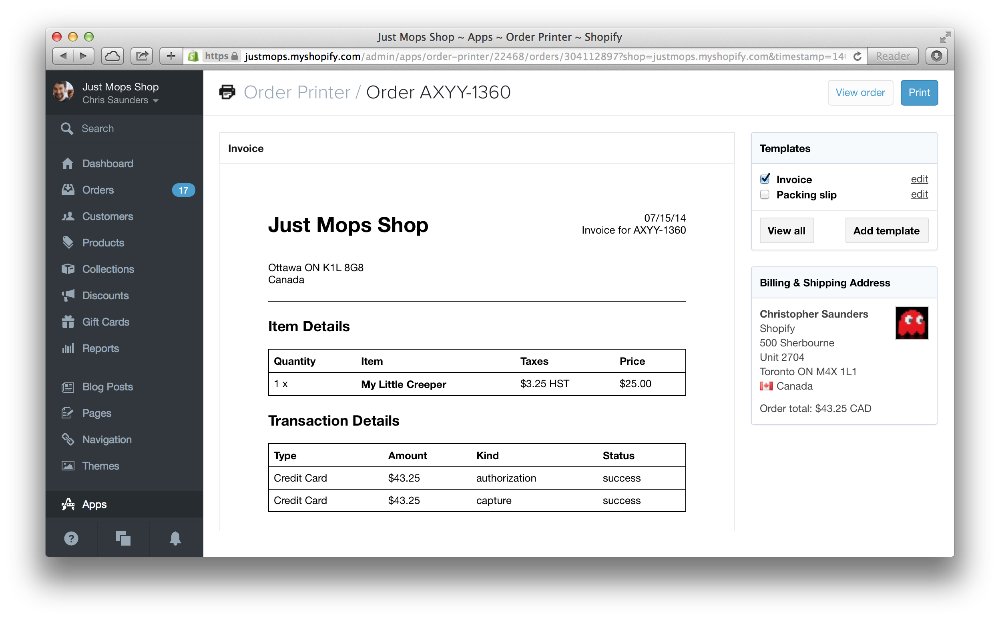
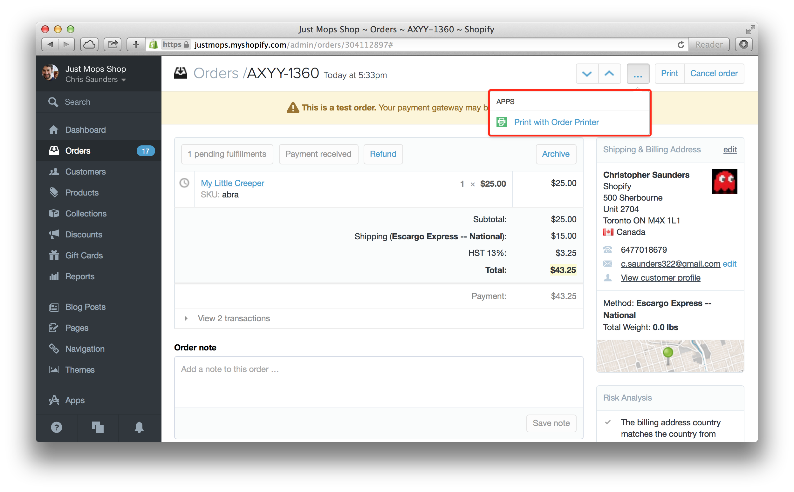

# The Shopify API

## Chris Saunders 

---

# API?

## Allows developers to extend the Shopify platform

---

# The Team


---

# What kinds of needs do merchants have?

---

## Unique Integrations

## Deeper Analysis

## Complex Processing

---


---

# API Demo

---

# API Demo

## List Products

### GET https://domain/admin/products.json

---

# API Demo

## Get Single Product

### GET https://domain/admin/products/1234.json

---

# API Demo

## Create A Product

### POST https://domain/admin/products.json

---

# API Demo

## Update a Product

### PUT https://domain/admin/products/1234.json

---

# API Demo

## Remove a Product

### DELETE https://domain/admin/products/1234.json

---

# Shopify Success Codes

---

# 200 OK


---

# 201 Created


---

# Shopify Error Codes

---

# 401 Unauthorized


---

# 404 Not Found


---

# 422 Unprocessable Entity


---

# 429 Too Many Requests


---

# Any 500 Error


---

# Staying up to date with Webhooks

---


---

# Staying up to date with Webhooks

- Let us tell you when things have changed
- Don't bite into your API call limits
- Let you subscribe to the kinds of data you are interested in
- Data is signed

---

# Webhooks

- You need the right permissions to register for a webhook
  - Can't register for order creation webhooks if you can only read products
- Don't include historical data
  - Webhooks contain a snapshot of the data when it was delivered, not when it was queued

---

# Webhooks

- The data in the webhook is slightly different from our API responses
  - No root node (i.e. {data} instead of {order: {data}})

---

# Registering a Webhook

---

# Supporting multiple Shops

- Install App from App Store
- Show how to set up an OAuth app from partners dashboard

---

# Serving your Apps

Use the Embedded App SDK to give your customers a nicer experience

- Provides hooks to use Shopify styled modals, popups, etc.
- Keep user within their Admin instead of going to another website

---



---


---


---

# App Links

- Provide contextual actions on shopify resources
- Shortcuts to areas of your application
- Added through the Partner Dashboard

---


---



---

# Shop Storefront

## Script Tags to easily provide storefront javascript
## Application proxies to provide custom URLs

---

# Script Tags

## Let's you inject external javascript into a shops storefront
## Associated to an app installation. Removing app also removes the script tags

---

# Registering a Script Tag

---

# Application Proxies

- Allow you to render data in the storefront
- Return application/liquid as the content type
  - Shopify will render it with the shops theme!
  - Any liquid inside the response will be evaluated by Shopify
- Return anything else such as text/html
  - Shopify will just render the content as is without any styles

---

# Application Proxy Example

```ruby
require 'sinatra'

get '/proxies/products-with-even-ids' do
  headers 'Content-Type' => 'application/liquid'
  """
  <p>Products with Even Ids</p>
  
    <ul>
      
        <li>{{ product.title }}</li>
      
    </ul>
  
  """
end
```

---

## http://teesforthepeople.com/
## http://manykitchens.com/

---

# Multipass

- Only available to Shopify Plus customers
- Associates Shopify customers with external identities (e.g from forums)
- Shop needs to have multipass enabled on their Checkout Settings

---

# Carrier Services

---


---

# http://manykitchens.com/

# http://theprintful.com/

---

# Fulfillment Services

---

# http://theprintful.com

---

# Tools

- Exposing development environments to the world
- API Client Libraries
- Ways to Easily Play with the API

---

# Exposing your environment to the world

`ngrok 3000`

- You can use ngrok to expose your development server to the world
- Use the given domain when registering webhooks, carrier services, etc.

---

# Official API Client Libraries

## github.com/shopify/shopify_api
## github.com/shopify/shopify\_python\_api

---


---

# Live Coding Demo

* Build an application that authorizes against shopify
* Fetches proucts from the Shopify API
* Registers a carrier service to provide shipping rates
* Registers a fulfillment service to provide inventory and tracking numbers

---

# Getting Help

---

# ecommerce.shopify.com/c/shopify-apis-and-technology

---

# Q & A
